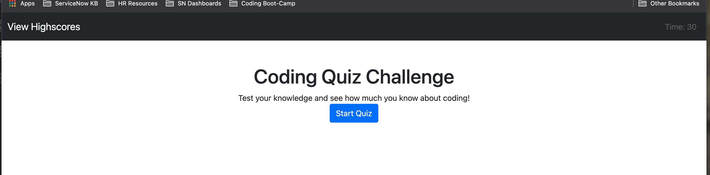
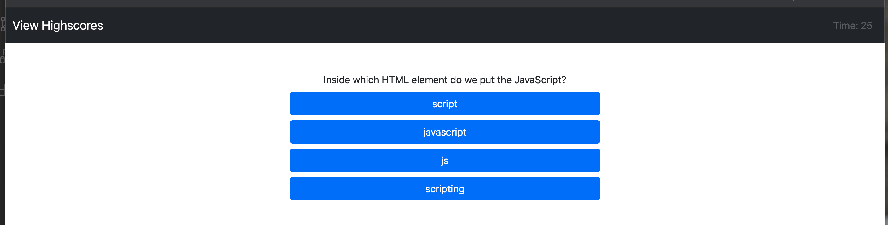
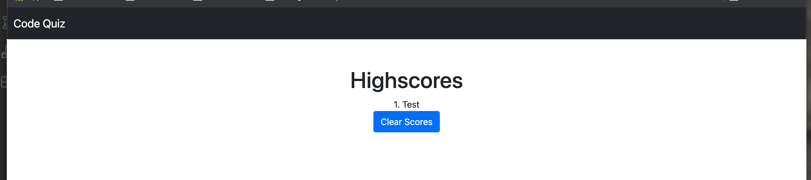

# Coding_Quiz

This repository was created to show case my ability to work with HTML, CSS, and Javascript by creating a responsive web page that presents a Coding Quiz. Once done taking the quiz, you will be able to store your highscore on the "Highscore" Page. The contestant taking this quiz will have 30 seconds to answer 5 questions. 

Good Luck!

## Screenshot of Steps & Functionality below

